# 🛍️ Furni-Store

**Furni-Store** es un sistema de gestión de comercio electrónico desarrollado en PHP y MySQL con librerias de Bootstrap y TailwindCSS. Este proyecto tiene como objetivo proporcionar una plataforma para administrar productos, clientes y transacciones de manera eficiente.

## 🚀 Características principales
- 🛒 **Gestión de productos**: Agregar, editar y eliminar productos del inventario.
- 👤 **Gestión de clientes**: Registro, inicio de sesión y perfiles de usuario.
- 🛍️ **Carrito de compras**: Permite a los clientes agregar productos al carrito y realizar compras.
- 📊 **Panel administrativo**: Control total del sistema, con opciones para gestionar usuarios, ventas y estadísticas.
- 📧 **Sistema de contacto**: Formulario para que los usuarios se comuniquen con el administrador.
- ✅ **Notificación de compras exitosas**: Página de éxito tras completar una compra.

## 📂 Estructura del proyecto

```plaintext
📦 Furni-Store
┣ 📂 clases           # Clases PHP para la lógica del negocio
┣ 📂 config           # Configuraciones de la base de datos
┣ 📂 dashboard        # Panel administrativo
┣ 📂 includes         # Archivos reutilizables como headers y footers
┣ 📄 about.php        # Página de "Acerca de nosotros"
┣ 📄 admin.php        # Página principal del administrador
┣ 📄 cart.php         # Página del carrito de compras
┣ 📄 contact.php      # Página de contacto
┣ 📄 details.php      # Detalles de productos
┣ 📄 get_cliente.php  # Consulta de clientes
┣ 📄 index.php        # Página principal
┣ 📄 login.php        # Página de inicio de sesión
┣ 📄 loginlog.js      # Registro de inicio de sesión (JavaScript)
┣ 📄 logout.php       # Cerrar sesión
┣ 📄 profile.php      # Perfil del usuario
┣ 📄 purchase_details.php  # Detalles de las compras realizadas
┣ 📄 register.php     # Registro de nuevos usuarios
┣ 📄 registerlog.js   # Registro de usuarios (JavaScript)
┣ 📄 registrar_venta.php  # Registro de ventas
┣ 📄 shop.php         # Página de la tienda
┣ 📄 success.php      # Página de éxito tras una compra
```
## 🛠️ Tecnologías utilizadas
Frontend: HTML, CSS, JavaScript
Backend: PHP
Base de datos: MySQL
## 💻 Cómo ejecutar el proyecto
1. Clonar el repositorio
git clone https://github.com/FJMoisesRomero/Furni-Store.git
2. Configurar la base de datos
Importa el archivo de la base de datos furni_store.sql (ubicado en la carpeta config) a tu servidor MySQL.
Configura las credenciales de conexión a la base de datos en config/db.php.
3. Configurar el servidor local
Instala XAMPP o cualquier servidor local con soporte para PHP y MySQL.
Copia los archivos del proyecto a la carpeta htdocs o la equivalente en tu servidor local.
4. Ejecutar la aplicación
Abre tu navegador y accede a la URL: http://localhost/Furni-Store/

## Echa un vistazo al proyecto en http://furnistore.rf.gd
## 📸 Capturas del proyecto
<div style="display: flex; flex-wrap: wrap; gap: 10px;">
  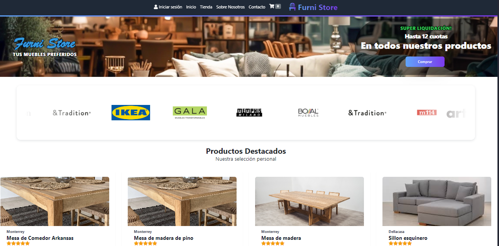
  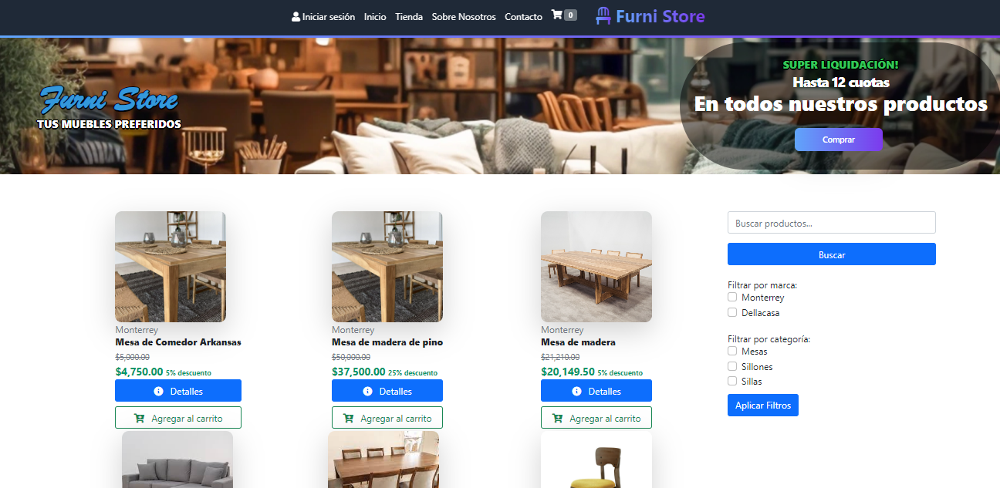
  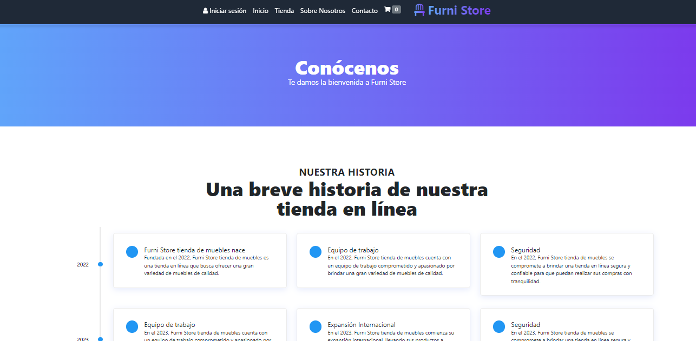
  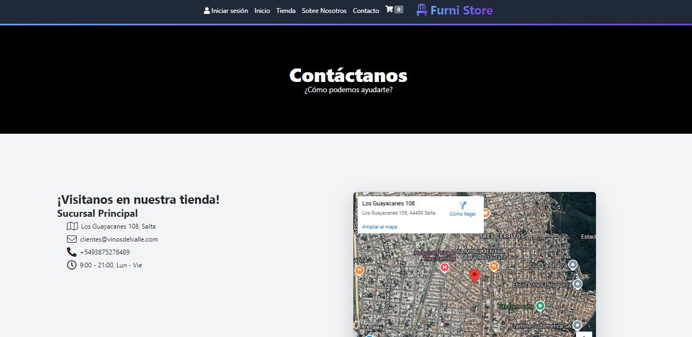
  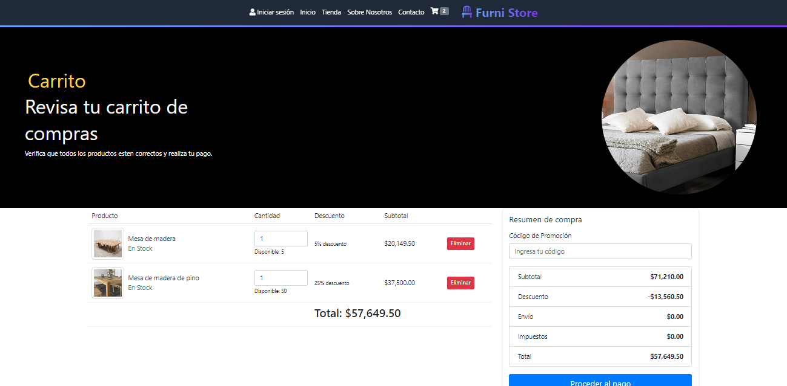
  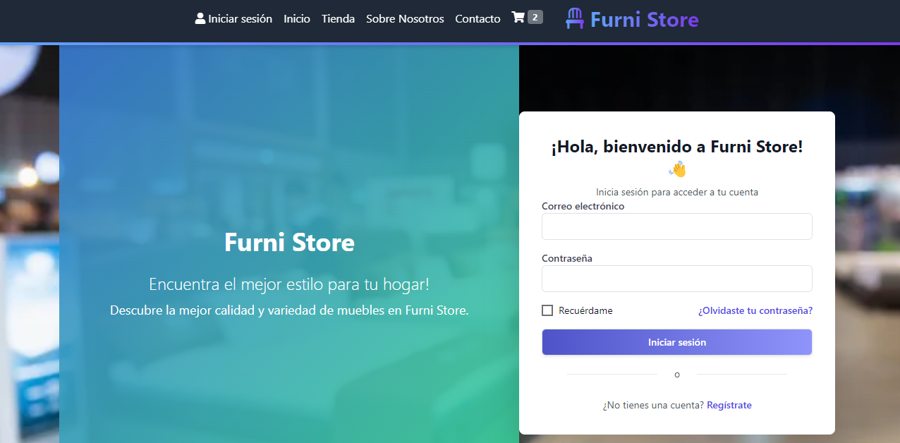
  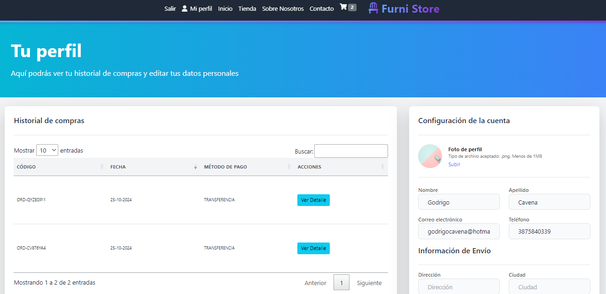
  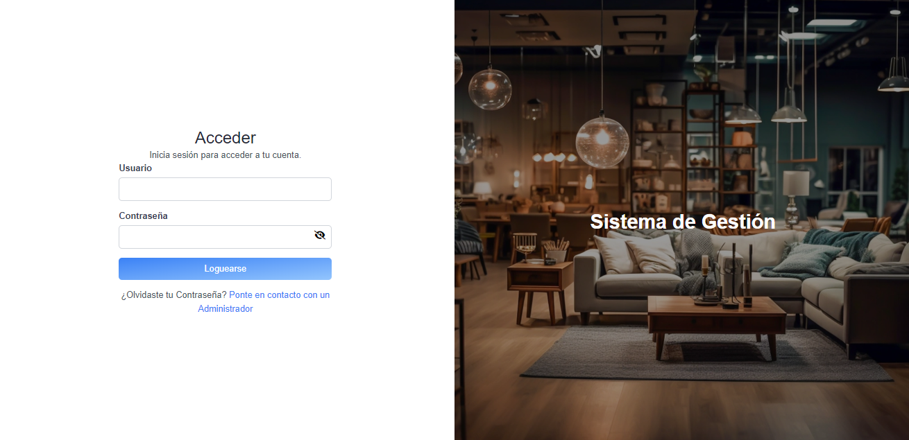
  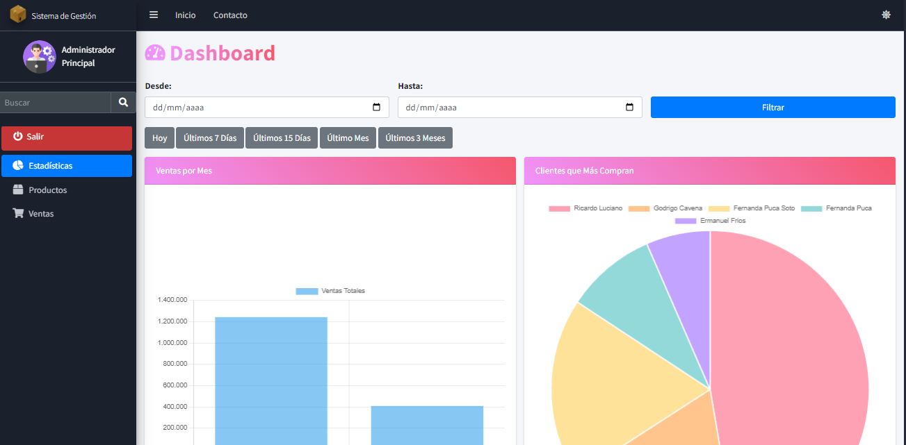
  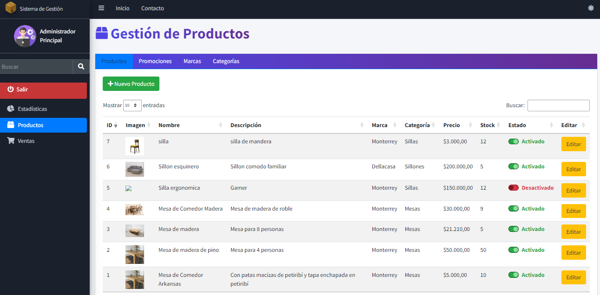
  
  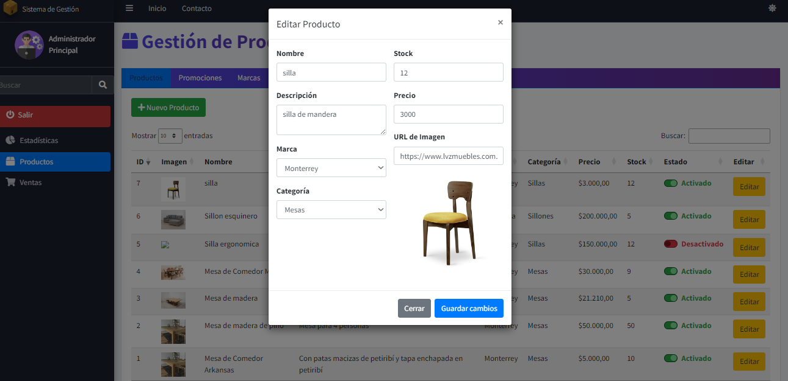
</div>


## 🤝 Contribuciones
Este proyecto fue creado con fines educativos. Sin embargo, cualquier sugerencia o contribución es bienvenida. 

## 📝 Licencia
Este proyecto es un aporte para la comunidad asi que sientete libre de utilizarlo.

¡Gracias por visitar este proyecto! Si te ha resultado útil, no dudes en darle una estrella ⭐ en GitHub.
